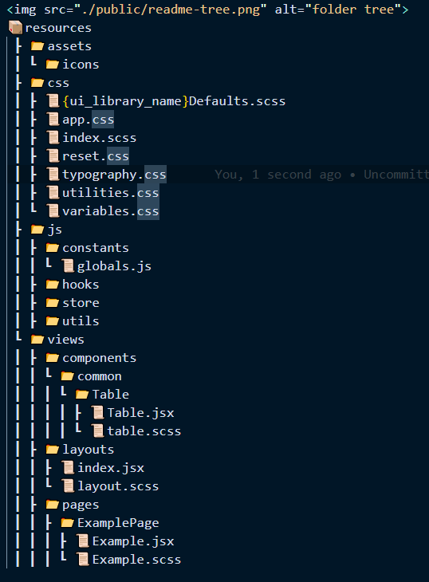

<div style="height: 100px;background: linear-gradient(90deg, #FC466B 0%, #3F5EFB 100%);">
<p style="font-size: 36px;line-height: 100px;text-align: center">Laravel Inertia Template</p>
</div>
<br/>

## This is the starter template for Inertia js + React for fullstack project.


# Stack / Features
1. #### [Laravel](https://laravel.com/) 9.x
3. #### [Inertia](https://inertiajs.com/) (server-side: 0.5.4 & client-side: 0.11.0)
2. #### [React](https://reactjs.org/) 17.x
5. #### [Vite](https://vite.io/) 2.x
6. #### [Ziggy](https://github.com/tighten/ziggy) (Laravel named routes on frontend)
4. #### [TailwindCSS](https://tailwindcss.com/) 3.x (plugins included: nesting, auto-imports, autoprefixer)
5. #### [lodash](https://lodash.com/) 4.x
6. #### [clsx](https://github.com/lukeed/clsx) 1.x


# Quick Start

```bash
git clone

composer install 
cp .en.example .env
php artisan key:generate

npm install or yarn 

npm run dev

````

# Documentation
### Use [jsDocs](https://jsdoc.app/about-getting-started.html) for documentation
#### Example:
````bash

/**
 * @param {object} params
 * @description Used to handle the request
 * @returns {object}
*/
function (params) {
 // API request

 return {};
}

````
# Naming convention 
[Read about Programming Case Types](https://chaseadams.io/posts/most-common-programming-case-types/)
- For folders use camel-case.
- For React components (.jsx) use PascalCase.  
- For JavaScript files use camelCase.

# Folder structure



## Folder Definitions:
 ### assets folder : Add images or icons.
 _______________________________________________________________________
 ### constants : Add reuseable constant.
 _______________________________________________________________________
 ### constants -> globals.js : Add reuseable enums.
 _______________________________________________________________________
 ### store : Create store / reducers and actions for the app.
 _______________________________________________________________________
 ### utils : Add utility functions.
 _______________________________________________________________________

  <div style="color: pink;font-size: 17px"> Styling & tailwindcss</div>


 
  
  ### css -> app.css : Use this file just for imports.
  _______________________________________________________________________

  ### css -> utilities.css : Use this create your custom utility classes.
  _______________________________________________________________________

  ### css -> index.css : Use this to add custom styling for your pages / components.
  _______________________________________________________________________


  ### css -> {ui_library_name}Defaults : Use this file to override UI component library styling. e.g: for antd the file name is antdDefaults.scss.
  _______________________________________________________________________


<br />
<br />
  <p style="color:khaki;font-size: 17px"> For common-components and pages make sure to add the styling file in the same folder as the component.  </p>

# Contribution
### For contribution fork the project and make a PR.